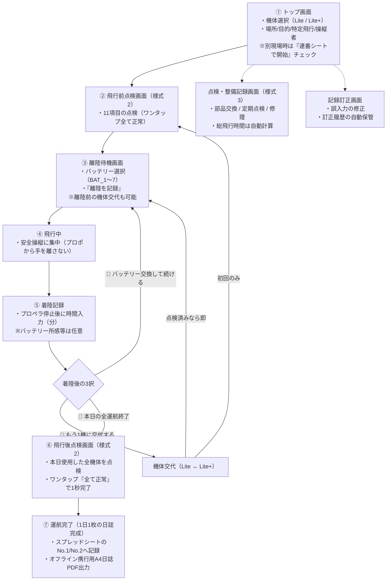

# 01_ドローン運航記録_設計書

## 1. アプリ概要
本システムは、ドローン（AUTEL EVO Lite / EVO Lite+）の特定飛行および日常運航において、航空法第132条の88に基づく「飛行日誌の作成・携行・保管義務」を完全に満たし、現場で迷わず最短操作で記録・管理を行うためのWebアプリケーション（Google Apps Script + Googleスプレッドシート）です。

---

## 2. 開発背景と目的
1. **法令完全適合（国土交通省「無人航空機の飛行日誌の取扱要領」準拠）**
   - 特定飛行（DID、夜間、目視外、人・物件30m未満等）での10万円以下の罰則リスクを排除。
   - 飛行記録（様式1）、日常点検記録（様式2）、点検整備記録（様式3）の3大記録を網羅。
2. **非エンジニア・現場操縦者の運用最適化（迷わない最短ルート）**
   - 現場での入力操作を最小限（基本はワンタップ、通常飛行時は最短3分で完了）。
   - 分からない任意項目は空欄のまま進行可能。異常や不具合がある場合のみ詳細項目を自動展開。
   - 誤操作・電波障害（圏外）・画面リロードに耐える自動下書き保存機能。
3. **監査・トラブル対応（公的証跡の担保）**
   - 警察官や航空運航安全監督官からの提示要請に備え、電波のない山間部でも提示できるPDF即時出力。
   - 誤記修正時の改ざん防止・監査ログ（訂正履歴シート）の自動保存。

---

## 3. システム構成と対象機体

### 3.1 対象機体
- **EVO Lite**（登録記号：JU3268805C02）
- **EVO Lite+**（登録記号：JU3269B165D2）
- バッテリー管理：7本（BAT_1 〜 BAT_7）個別管理

### 3.2 技術スタック
- バックエンド：Google Apps Script（V8エンジン）
- データベース：Googleスプレッドシート（ID: `10PMEteELQRRWnqc5mVmF6tQCfxFEJEGe2LitpDhYqk8`）
- フロントエンド：HTML5 / CSS3 / Vanilla JavaScript（レスポンシブ対応・モバイル優先）

---

## 4. 運航フローと画面遷移（2機交互運航・夕方まとめ点検・複数現場対応）

---

## 5. 法定記録項目の網羅表

| 記録区分 | 法定様式 | 実装項目 | 自動化・入力補助 |
|---|---|---|---|
| **飛行記録** | 様式1相当 | 飛行年月日、操縦者氏名、技能証明書番号、目的、経路、特定飛行区分、離陸場所・時刻、着陸場所・時刻、飛行時間、**総飛行時間**、安全影響事項、不具合および対応 | 操縦者名・番号初期値保持、特定飛行複数選択、時刻自動取得、総飛行時間自動積算 |
| **日常点検記録** | 様式2相当 | 点検実施年月日、場所、実施者氏名 【飛行前11項目】機体全般、プロペラ・フレーム、通信系統、推進系統、電源系統、自動制御系統、バッテリー、操縦装置、灯火、カメラ、リモートID 【飛行後4項目】機体全般、プロペラ・フレーム、発熱、その他 【特記事項】不具合箇所、事象内容、処置内容、確認者 | 「全て正常」一括チェックボタン、異常時のみ詳細入力欄を展開、不具合処置の記録欄 |
| **点検整備記録** | 様式3相当 | 実施年月日、**総飛行時間**、場所、実施者氏名、作業区分、理由、作業内容、交換部品名、確認結果（合否）、次回予定時期 | 機体ごとの総飛行時間をシステムが自動計算して入力、バッテリー履歴との整合 |
| **気象情報** | 安全基準準拠 | 天候（晴/曇/雨/強風注意）、風速（0-1m/s、2-3m/s、4-5m/s、6m/s以上）、風向（8方位） | ワンタップ入力チップ、飛行目的セルの末尾に自動結合（A4レイアウト厳守） |
| **オフライン耐性** | 現場継続性 | 電波圏外での全操作継続、ローカル同期待ちキュー、電波復帰時の一括スプレッドシート反映 | 電波バッジ・未同期バッジ・自動同期 |

---

## 6. 実運用における重要保護・プロ現場機能

### 6.1 手打ちゼロ自動入力・連携機能（現場での文字入力ゼロへ）
1. **GPSワンタップ住所・位置自動取得（逆ジオコーディング）**
   - 現場でスマホの現在地（GPS）ボタンをタップするだけで、緯度経度から住所（都道府県・市区町村・町名）を自動取得。
   - 離陸場所・着陸場所および飛行経路（「離陸地点周辺 半径〇〇m」）を即座に自動流し込み。
2. **直前履歴ワンタップ引用**
   - 「前回の飛行と同じ場所・目的・操縦者・許可証で開始」ボタンで、1タップで前回設定を全復元。
3. **お気に入り現場プリセット登録・呼出**
   - 自宅練習場、よく行く空撮現場、クライアント現場などを登録し、ワンタップで場所・経路を即時セット。
4. **安全第一の着陸記録（飛行中のスマホ操作ゼロ）**
   - 飛行中に操縦者がプロポから手を離す危険を完全に防ぐため、リアルタイムのタイマー停止強制を廃止。
   - プロペラが完全停止した後に、送信機（Autel Explorer）アプリに表示された飛行時間（例：12分）を見て「実飛行時間（分）」を入力・確認するだけで着陸記録が完了。
   - バッテリーの「使用後サイクル数」「所感」は完全任意（空欄のまま素通り可能）。

### 6.2 行政・監査対応の防壁機能（ペナルティ・違反リスクゼロへ）
1. **国土交通省 許可・承認書番号の連動＆有効期限切れアラート**
   - 特定飛行時に必要な東空運・阪空運の許可承認番号（例：東空運第XXXX号）を保持。
   - 許可期間の満了30日前から警告（黄色）、期限切れは赤色アラートで特定飛行を強力に注意喚起。
2. **機長（操縦者）と補助者の分離記録**
   - 目視外飛行やDID飛行時の補助者氏名を記録し、飛行日誌取扱要領の記載要件をクリア。
3. **安全影響事項クイックタグ選択**
   - 「突風（風速5m以上）」「野鳥の急接近」「電波微弱アラート」「GPS捕捉遅延」「バッテリー急低下・発熱」「なし（安全運航）」などのタグをワンタップで選択。

### 6.3 信頼性・データ保護機能
1. **自動下書き保存（LocalStorage）**
   - 現場での電話着信やブラウザ誤更新でも、入力内容が消えずに即座に復元。
   - サーバー送信が正常完了した時点で該当下書きを安全に消去。
2. **改ざん防止・訂正履歴ログ**
   - スプレッドシートを直接修正せず、Webアプリから「訂正理由」とともに修正を実行。
   - `訂正履歴` シートに「日時・対象シート・項目・訂正前・訂正後・理由・実行者」を永続保存。
3. **オフライン提示用PDF出力**
   - 通信圏外の現場でも即座に提示できるよう、当日の飛行日誌（A4横向きフォーマット）をPDFとして端末に保存可能。
4. **二重送信・競合防止**
   - Google Apps Script の `LockService` による排他制御（20秒ロック）。
   - 送信中のボタン無効化およびローディング表示。

### 6.4 入力漏れ具体的ハイライト ＆ セッション衝突自動復旧機能
1. **未入力箇所の具体的箇条書き表示 ＆ 赤枠ハイライト（手戻りゼロ）**
   - 送信時に未入力項目や不備がある場合、「【機体】【飛行経路・場所】が入力されていません」など、抜けている項目の名称を画面上部の警告バナーで具体的に明示。
   - 抜けている入力欄の枠線を赤色（`.input-error`）で強調し、該当箇所へ自動スクロール＆フォーカス。
   - 値を入力・修正すると自動で赤枠が消える親切設計。
2. **中断セッションの検知と選択復旧（再開／新規開始）**
   - 途中でブラウザを閉じたり中断した場合、画面上部に「⚠️ 前回の記録が途中で中断されています（EVO Lite / 飛行前点検など）」と通知。
   - 運航開始ボタンを押した際も、「前回の記録が中断されたまま残っています」と詳細（機体・進捗・操縦者・場所）を表示し、**「▶ 続きから再開する」**か**「🗑 破棄して新しく開始する」**をワンタップで選択可能。

