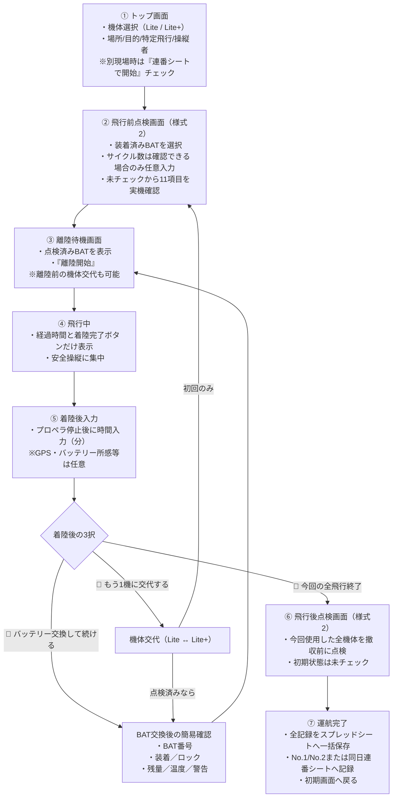

# 01_ドローン運航記録_設計書

現場運用版：**v2026.09.06.2**

## 1. アプリ概要
本システムは、ドローン（AUTEL EVO Lite / EVO Lite+）の特定飛行および日常運航において、航空法第132条の89に基づく飛行日誌の作成・携行・保管を支援し、現場で迷わず最短操作で記録・管理を行うためのWebアプリケーション（Google Apps Script + Googleスプレッドシート）です。

---

## 2. 開発背景と目的
1. **法定記録の作成支援（国土交通省「無人航空機の飛行日誌の取扱要領」参照）**
   - 特定飛行（DID、夜間、目視外、人・物件30m未満等）で必要となる飛行日誌の記録漏れを防止。
   - Webアプリでは、現場で毎回必要となる飛行記録（様式1）と日常点検記録（様式2）の記録漏れを防止。
   - 点検整備記録（様式3）は、実施時にスプレッドシートの原本へ手動記入して管理する。
2. **非エンジニア・現場操縦者の運用最適化（迷わない最短ルート）**
   - 現場での入力操作を最小限（基本はワンタップ、通常飛行時は最短3分で完了）。
   - 分からない任意項目は空欄のまま進行可能。異常や不具合がある場合のみ詳細項目を自動展開。
   - 誤操作・通信断に備えた自動下書き保存機能。圏外での新規起動・再読み込みは対象外とし、出発前に読み込み済みの画面で運用する。
3. **保存後の管理を現場操作から分離**
   - 点検整備記録、保存済み記録の検索・印刷・訂正は、Googleスプレッドシートで必要な時に行う。
   - スマートフォンからGoogle Drive／Googleスプレッドシートを開き、飛行日誌を参照・提示できる状態にする。
   - 通信圏外での提示が必要な運航では事前のオフライン保存を検討するが、通常のWebアプリ工程には組み込まない。

### 2.1 開発の前提と設計思想（実務と法令の境界線）

本システムは、航空法第132条の89、国土交通省「無人航空機の飛行日誌の取扱要領」および「無人航空機の飛行日誌の取扱いに関するガイドライン」を基準として、必要な飛行日誌の作成・携行・保管を支援する。

同時に、ワンオペの現場で操縦者が安全確認と記録を迷わず完了できることを重視する。本システムの目的は、確認項目を機械的に増やすことではない。法規、安全、機体の取扱説明書および適用する飛行マニュアルを守りながら、現場で確認できる内容を、確認できる時点で、必要最小限の操作により正確に記録することである。

Webアプリの役割は、運航条件の入力、飛行前点検、離着陸、バッテリー・機体交代、飛行後点検および最後の一括保存に限定する。点検整備、保存済み記録の検索・印刷・訂正は、毎回の現場運航とは頻度と目的が異なるため、Webアプリに画面を設けずスプレッドシートで管理する。既存の記録シートや履歴は削除せず、そのまま保持する。

#### 2.1.1 柔軟な取扱いの採用と過剰仕様の撤回

過去に検討した「バッテリー交換ごとに11項目の飛行前点検をすべて繰り返す」などの一律厳格化は、現場操作を過剰に増やすため、本システムの標準仕様としては採用しない。

国土交通省の[「無人航空機の飛行日誌の取扱いに関するガイドライン」](https://www.mlit.go.jp/common/001599241.pdf)では、機体認証を受けていない機体について、単一の飛行エリア内で同一ミッションの飛行を連続して実施する場合、複数回の離着陸や電源の停止・作動を含めて「1飛行」と扱い、飛行記録を1行にまとめることができるとされている。

本システムでは、この条件を満たす一連の連続飛行について、次の運用を基本とする。

- **正式な飛行前点検**：一連の連続飛行を開始する前に、使用機体、装着済みBAT番号および11項目を実機で確認する。
- **サイクル数**：装着後、Autel Skyで確認できる場合に限り任意で入力する。確認できない場合は空欄で進める。
- **バッテリー交換**：11項目の正式点検は繰り返さず、交換後のBAT番号、確実な装着・ロック、残量・温度・警告表示を確認する。
- **飛行後点検**：一連の連続飛行がすべて終了した撤収時に、今回使用した機体について実施する。
- **飛行記録**：各離着陸の実績を、使用BATごとに飛行記録欄へ1行ずつ残す。柔軟な取扱いにより1行へ集約できる場合でも、本システムでは現場で実際に飛行した回数分の記録欄を使用する。1つのNo.1／No.2記録枠には最大7飛行を記入し、超過分は次の空き記録枠、さらに必要な場合は同日連番シートへ続ける。
- **BAT履歴**：各飛行の使用BAT、個別飛行時間およびサイクル数を、バッテリー保守と履歴確認のためBAT別シートにも個別に保持する。
- **一括保存**：運航中は各飛行を未確定下書きとして保持し、飛行後点検完了時に、飛行回数分の行とBAT別履歴をまとめてスプレッドシートへ保存する。「一括保存」は複数飛行を1行へ合算することを意味しない。

ただし、次の場合は連続飛行としてそのまま継続せず、飛行中止、再点検又は新しい運航記録への切替を行う。

- 機体、プロペラ又はバッテリーに異常が認められた場合
- 衝突、接触、ハードランディング、警告表示その他の安全上の事象があった場合
- 飛行エリア又は飛行目的が変わった場合
- 未点検の別機体へ交代する場合
- 機体の取扱説明書、機体設計者の指定又は適用する飛行マニュアルが、別の点検頻度を求めている場合

異常が認められた場合は、簡易確認による継続を認めず、飛行を中止して必要な点検・整備・記録を行う。

#### 2.1.2 仕様変更・項目追加の7つの判断基準

今後、入力項目、確認画面、必須条件又は自動処理を追加・変更する場合は、実装前に次の7項目を確認する。

1. **法規・安全上、本当に必要か**
   - 法令、許可・承認条件、適用する飛行マニュアル又は機体の安全な取扱いに必要な内容か。
   - 推奨事項や過剰な解釈を、一律の必須項目にしていないか。
2. **その時点で確認できるか**
   - 現物、Autel Sky又は現場の状況から、その画面を操作する時点で確認できる内容か。
   - 後でなければ分からない内容を、先に入力させていないか。
3. **自動取得又は引継ぎにできないか**
   - 日付、時刻、飛行時間の計算、GPS、機体情報、直前の運航条件などを自動取得又は引継ぎできないか。
4. **必須にすると現場を邪魔しないか**
   - 操縦、安全確認、バッテリー交換又は撤収を不必要に遅らせないか。
   - 飛行中にスマートフォン操作を要求していないか。
5. **初期値による虚偽記録が起きないか**
   - 実機を確認していない状態で「正常」「異常なし」などが記録されないか。
   - 点検結果は未確認状態から開始し、操縦者の確認操作を経て確定するか。
6. **戻る・中断・通信失敗でも正確さを保てるか**
   - 一つ前の画面へ戻って修正できるか。
   - 修正前の内容が残らず、最新の内容で上書きされるか。
   - 通信失敗や再読み込みが発生しても、未確定記録と確定済み記録を混同しないか。
7. **最後に正式な記録として不足なく残るか**
   - Webアプリが保存する飛行記録・日常点検記録と、スプレッドシートで管理する点検整備記録を合わせて確認・提示できるか。
   - 法定記録と機体・バッテリー保守用の詳細記録を区別して保持できるか。

いずれかの判断基準に問題がある場合は、そのまま必須機能として追加しない。自動化、任意入力、入力時点の変更又は機能自体の不採用を検討する。この7項目は機能追加を増やすためではなく、不要な機能と過剰な必須入力を防ぐための判断基準とする。

---

## 3. システム構成と対象機体

### 3.1 対象機体
- **EVO Lite**（登録記号：JU3268805C02）
- **EVO Lite+**（登録記号：JU3269B165D2）
- バッテリー管理：7本（BAT_1 〜 BAT_7）個別管理

### 3.2 技術スタック
- バックエンド：Google Apps Script（V8エンジン）
- データベース：Googleスプレッドシート（[閲覧・コメント用リンク](https://docs.google.com/spreadsheets/d/10PMEteELQRRWnqc5mVmF6tQCfxFEJEGe2LitpDhYqk8/edit?usp=sharing) / ID: `10PMEteELQRRWnqc5mVmF6tQCfxFEJEGe2LitpDhYqk8`）
- フロントエンド：HTML5 / CSS3 / Vanilla JavaScript（レスポンシブ対応・モバイル優先）

### 3.3 GASコードの分割管理と統合版の自動生成

v2026.09.06.1において、GASの実行ロジックを変更せず、GitHub上のコード管理方式を単一ファイルから分割ソース方式へ変更した。目的は、開発時の保守性を高めながら、非エンジニアが行うGASへの手動デプロイを従来どおり1ファイルのコピー＆ペーストで完了できるようにすることである。

#### 3.3.1 正本と分割構成

開発用の正本は、次の4ファイルとする。

1. `src/00_config.gs`：基本設定、定数、機体・BAT・点検項目定義
2. `src/10_server_workflow.gs`：Webアプリ入口、入力検証、運航確定処理
3. `src/20_spreadsheet_io.gs`：日付シート・No.1／No.2割当、帳票書込み、機体累計、BAT履歴処理
4. `src/30_web_app.gs`：`APP_HTML`全体、HTML、CSS、画面用JavaScript

分割時は、関数又は`APP_HTML`文字列の途中で切断していない。現行`Code.gs`の記載順を保ったまま4ファイルへ切り分け、関数内容、関数名、変数名、HTML、CSS、JavaScript、処理順及び既存機能を変更していない。

#### 3.3.2 結合・生成・検証

- 結合順は`scripts/source-order.json`で固定し、ファイルシステムの列挙順には依存しない。
- `scripts/build.mjs`が4ファイルを指定順で結合し、GAS貼り付け用の`dist/Code.gs`を生成する。
- `dist/Code.gs`は自動生成物であり正本ではない。先頭に手動編集禁止のコメントを付け、直接編集しない。
- `.github/workflows/build-dist.yml`により、`src/`等の更新時にGitHub Actionsで生成、構文検査、`src/`との一致検証及びTEST 1～15を実行する。
- `src/`と`dist/Code.gs`が不一致の場合、未登録又は重複した分割ファイルがある場合、生成又は回帰テストに失敗した場合は処理を失敗させる。
- mainへの更新時は、生成した`dist/Code.gs`を自動コミット・pushする。自動反映後にリモート上の`dist/Code.gs`を再取得し、生成内容と一致することを確認する。

#### 3.3.3 初回移行時の同一性確認

初回移行時、旧ルート`Code.gs`と4つの`src/`を結合した本体について、バイト単位の比較及びSHA-256比較を実施し、両方が次の値で完全一致することを確認した。

```text
6f610136b182b5338baf1c1c0b3cfb9574bb7d6fea86f93daf45467f1425fc3a
```

自動生成ヘッダーを除いた`dist/Code.gs`本体も旧`Code.gs`と完全一致する。このため、分割導入によるv2026.09.06.1の実行ロジック、画面、帳票処理及び既存機能への変更はない。

#### 3.3.4 GASへの配置と旧Code.gsの扱い

GitHub上では分割して管理するが、GAS側では今後も単一の`Code.gs`として運用する。GASへ配置するのは`dist/Code.gs`全文だけであり、`src/`の各ファイルをGASへ個別配置しない。

旧ルート`Code.gs`は、移行確認及び問題発生時の復旧用として当面保持する。ただし正本は`src/`であり、通常のGAS更新には`dist/Code.gs`を使用する。旧ルート`Code.gs`の削除は、本移行の確認後に別途判断し、自動的には削除しない。

### 3.4 v2026.09.06.2 保存処理の堅牢性設計

v2026.09.06.2では、通常操作のUI、画面遷移、帳票の見た目、既存のシート構造及び入力方法を変更せず、`finishAircraft()`による最終一括保存の内部処理をロールフォワード方式へ変更した。途中失敗時に書込み済みデータを取り消すのではなく、最初に確定した保存計画を再利用して未完了処理を安全に完了させる。

#### 3.4.1 固定保存計画と識別

- クライアントで新規運航を開始する時に、`crypto.randomUUID()`を優先してUUID v4形式の`draftId`を生成する。UUIDを利用できない環境では`crypto.getRandomValues()`により同形式を生成する。従来の時刻形式`draftId`は、既存下書きとの移行互換のため検証対象として受け入れる。
- 初回の保存開始前に、日付シート名、No.1／No.2、同日連番、各飛行行、各BAT履歴行、飛行前・飛行後点検のセル及び機体別原本の累計セルを固定する。再試行時に新しい保存先を探索しない。
- 固定保存計画は正規化した入力のSHA-256署名及び計画ハッシュとともに`PropertiesService`へ永続保存する。計画本体は容量上限を考慮してチャンク分割し、METAにチャンク数、全体ハッシュ、状態及び進捗を保持する。欠落又は改変されたチャンクは検出して保存を停止する。

#### 3.4.2 状態、進捗及びロールフォワード

- 保存状態は`pending`、`writing`、`failed`、`complete`で管理し、日付記録、BAT履歴、飛行後点検、機体累計、最終検証の各段階で進捗を永続更新する。
- 各セルについて保存計画作成時の値と書込み予定値を保持し、固定セルへ冪等に上書きする。現在値が予定値なら書込み済みとして続行し、開始値なら予定値を書き込み、それ以外なら手動変更又は別処理との競合として停止する。
- BAT履歴行には`draftId`と飛行番号から成る内部識別子をDeveloper Metadataとして付与する。表示上のBAT履歴レイアウトは変更せず、再試行時に同じ行であることを照合する。
- 日付記録、BAT履歴、飛行後点検、機体累計の主要段階で`SpreadsheetApp.flush()`を実行し、直後に対象セル及びDeveloper Metadataを読み戻して予定値との一致を検証する。
- 複数機体の累計は、各機体の開始値と絶対的な最終値を計画へ固定する。一方の機体更新後に失敗した場合も、再試行時は更新済みの機体を一致確認し、未更新の機体だけを固定最終値へ進める。
- 最終対象をすべて再照合した後に`complete`を記録する。`complete`後の同一`draftId`再送も入力署名の一致を確認し、同じ結果だけを返して再書込みしない。

#### 3.4.3 保存計画の保持と整理

- `complete`証明は30日間保持し、その期間は計画本体のチャンクを削除してMETAのみを残す。`CacheService`は応答結果の補助キャッシュとしてのみ使用し、保存完了判定の正本にはしない。
- 7日を超えた`pending`又は`failed`は、固定保存先の全対象を照合する。すべて未保存なら予約を安全に削除し、すべて保存済みなら`complete`へ復旧する。部分保存又は競合がある場合は自動削除せず`failed`として保持し、安全な再試行又は確認を可能にする。
- Propertiesの使用量を内部関数で集計できるようにし、期限切れの`complete`証明、孤立チャンク及び安全判定済みの古い計画を整理して容量増加を抑える。

#### 3.4.4 排他制御と障害試験

- 保存計画の作成から全書込み、読取検証及び`complete`記録までをScript Lockの範囲とする。20秒以内にロックを取得できない場合は、重複処理へ進まず再試行を案内する明確なエラーで停止する。
- 既存TEST 1～15を維持したうえで、T16～T23として、日付シート書込み直後、BAT_1直後、BAT_2直後、飛行後点検直後、EVO Lite累計更新後かつEVO Lite+更新前、最終flush直前、complete保存直前、complete後かつ応答返却前の各障害を注入する。
- 追加障害試験では、日付シートコピー直後、No.1／No.2書込み途中、Properties進捗保存失敗、CacheService失敗、同一・異なる`draftId`の競合、再送時の入力改変、固定セルの手動変更、Propertiesチャンク欠落、7日超計画の各状態及び30日超`complete`証明の整理を確認する。
- 各障害試験は「障害なしの正常保存1回」と「途中失敗後に同じ`draftId`で再試行」の最終状態を比較し、日付シート、記録枠、連番数、全飛行行、BAT履歴と内部識別子、点検結果、機体累計、表示形式及び完了状態が一致することを合格条件とする。

---

## 4. 運航フローと画面遷移（2機交互運航・夕方まとめ点検・複数現場対応）



---

## 5. 法定記録項目の網羅表

| 記録区分 | 法定様式 | 実装項目 | 自動化・入力補助 |
|---|---|---|---|
| **飛行記録** | 様式1相当 | 飛行年月日、操縦者氏名、技能証明書番号、目的、経路、特定飛行区分、離陸場所・時刻、着陸場所・時刻、飛行時間、**総飛行時間（累計時間）**、安全影響事項、不具合および対応 | 操縦者名・番号初期値保持、特定飛行複数選択、時刻自動取得、機体別原本を基準に総飛行時間を自動積算 |
| **日常点検記録** | 様式2相当 | 点検実施年月日、場所、実施者氏名<br>【飛行前11項目】機体全般、プロペラ・フレーム、通信系統、推進系統、電源系統、自動制御系統、バッテリー、操縦装置、灯火、カメラ、リモートID<br>【飛行後4項目】機体全般、プロペラ・フレーム、発熱、その他<br>【特記事項】不具合箇所、事象内容、処置内容、確認者 | 各区分の横に具体的な確認内容を併記、「全て正常」一括チェックボタン、異常時のみ詳細入力欄を展開、不具合処置の記録欄 |
| **点検整備記録** | 様式3相当 | 実施年月日、総飛行時間、場所、実施者氏名、作業区分、理由、作業内容、交換部品名、確認結果（合否）、次回予定時期 | 機体別原本が現在の累計時間マスター。点検整備時は該当原本をコピーして手動記入 |
| **気象情報** | 安全基準準拠 | 天候（晴/曇/雨/強風注意）、風速（0-1m/s、2-3m/s、4-5m/s、6m/s以上）、風向（8方位） | 3項目とも未選択から始まる任意入力。選択した項目だけを飛行目的セルの末尾に自動結合し、未選択項目は空欄のまま保存 |
| **通信断耐性** | 現場継続性 | 読み込み済み画面での操作継続、進行中の運航下書き1件を端末に保持、飛行後点検完了時に一括保存 | 電波状態表示・圏外時の確定保留・電波復旧後の再実行 |

運航開始後の各画面には、共通の「一つ前の画面に戻る」を画面上部に1つだけ表示する。戻り先のない初期画面では表示しない。全フライトと飛行後点検が終わるまではスプレッドシートへ書き込まず、1件の運航下書きに入力状態と画面履歴を保持する。戻った画面では前回のチェック状態・入力値を表示し、その場で修正して上書きできる。飛行中画面は経過時間と「着陸完了（プロペラ停止後）」だけを表示し、着陸後入力とは明確に分ける。

### 5.1 同一運航と連番シートの判断

- **同一現場・同一目的の連続飛行**：同じ運航下書きと日付シートで継続する。最初に正式な飛行前点検を行い、バッテリー交換時は交換部分に限定した簡易確認を行う。
- **同一条件での機体交代**：同じ日付系列の空いているNo.1／No.2枠を使用する。交代先の機体が未点検なら正式な飛行前点検、点検済みなら交換後BATの簡易確認へ進む。
- **記録枠の上限**：1つのNo.1／No.2記録枠は最大7飛行とする。同一機体が8回以上飛行した場合も保存を拒否せず、7飛行ごとに次の空き記録枠へ続ける。No.1とNo.2が埋まった場合は、同日連番シート（`日付_2`、`日付_3`…）のNo.1から継続する。
- **点検記録の対応**：同一機体が複数の記録枠にまたがる場合は、各記録枠にその機体情報、飛行前点検結果および飛行後点検結果を記録する。BAT履歴は各飛行につき1回だけ記録する。
- **現場または目的の変更**：現在の運航を飛行後点検まで完了して確定し、新しい運航として同日連番シート（`日付_2`、`日付_3`…）を作成する。
- この簡略運用は、国土交通省ガイドラインに示された、機体認証を受けていない機体による単一飛行エリア・同一ミッションの連続飛行を一つの飛行として扱える考え方を前提とする。機体認証を取得した機体又は適用する飛行マニュアルに別の実施頻度が定められている場合は、その条件を優先する。

### 5.2 機体総飛行時間とBAT履歴の分離

- 機体総飛行時間は機体ごとに管理し、`EVO Lite`は`点検整備記録_EVO Lite_原本`、`EVO Lite+`は`点検整備記録_EVO Lite+_原本`の「点検時の総飛行時間」を現在値のマスターとする。
- 各原本の「対象機体」は対応する機体へ固定し、原本をコピーして点検整備記録を作成する時の取り違えを防止する。
- 機種は日常点検シートのチェック位置から推定せず、`session`及び各`flight.model`の値を正として決定する。
- 導入時の機体累計は両機とも`00:00`とする。過去の日付シート又はBAT_1～BAT_7から初期値を算出・移行しない。
- 各飛行の実飛行時間を分単位で加算し、日付シートの各飛行行へ加算後の累計を`HH:MM`形式で記録する。「総飛行時間」と「総飛行時間（累計時間）」の両見出しを認識する。
- 時間部分は24以上を許可し、24時間で折り返さない。分部分は00～59だけを有効とし、不正値は0へ置換せず保存を中止して明確なエラーを表示する。
- No.1／No.2、7飛行ごとの次ブロック、機体交代及び同日連番シートの境界を越えても、累計は機体別に継続する。
- 全飛行記録、BAT履歴及び飛行後点検の書込み後に、各機体原本を最終累計へ更新する。`draftId`ごとの確定計画をScript Propertiesへ保持し、再送時は開始値と絶対的な最終値を照合して二重加算又は別処理による上書きを防ぐ。
- 点検、部品交換、修理又は改造を実施する時は、該当機体の原本をコピーして別名で履歴保存する。コピー後の過去シートは原本の累計更新対象にしない。
- BAT_1～BAT_7は従来どおり使用履歴・個別飛行時間・サイクル数の管理専用とし、機体総飛行時間の算出元には使用しない。既存履歴は変更せず、v2026.09.06.1以降のBAT累計表示を各BAT`00:00`から開始する。

---

## 6. 実運用における重要保護・プロ現場機能

### 6.1 手打ちゼロ自動入力・連携機能（現場での文字入力ゼロへ）
1. **GPSワンタップ住所・位置自動取得（逆ジオコーディング）**
   - 現場でスマホの現在地（GPS）ボタンをタップするだけで、緯度経度から住所（都道府県・市区町村・町名）を自動取得。
   - 離陸場所・着陸場所および飛行経路（「離陸地点周辺 半径〇〇m」）を即座に自動流し込み。
2. **直前履歴ワンタップ引用**
   - 「前回の飛行と同じ場所・目的・操縦者・許可証で開始」ボタンで、1タップで前回設定を全復元。
3. **お気に入り現場プリセット登録・呼出**
   - 自宅練習場、よく行く空撮現場、クライアント現場などを登録し、ワンタップで場所・経路を即時セット。
   - 登録データは端末のLocalStorageに保存。
   - **名前変更**：登録済み現場の表示名（name）のみを変更可能（設定済みの場所・経路（location・route）は維持）。
   - **削除機能**：不要になった登録現場の個別削除に対応（誤操作防止のため削除前に確認ダイアログを表示）。
   - **重複登録防止**：同一のlocation・routeを持つ現場は新規に重複登録せず、既存登録を案内する（別の名前が入力された場合は利用者の確認後にnameのみ変更可能）。既存の重複データは自動削除せず、利用者が選んで削除する運用とする。
4. **安全第一の着陸記録（飛行中のスマホ操作ゼロ）**
   - 飛行中に操縦者がプロポから手を離す危険を完全に防ぐため、リアルタイムのタイマー停止強制を廃止。
   - 「着陸完了（プロペラ停止後）」を押した時点で着陸時刻を端末内に保持する。その後、送信機（Autel Sky）に表示された飛行時間（例：12分）を入力・確認する。
   - バッテリーのサイクル数は装着後にAutel Skyで確認できる場合だけ、飛行前点検又は交換後確認画面で任意入力する。着陸後のバッテリー所感も任意とする。

5. **連続飛行時のBAT交換確認**
   - 同一現場・同一目的で同じ機体を続けて使用する場合、11項目の正式点検は繰り返さない。
   - 交換後のBAT番号、確実な装着・ロック、残量・温度・警告表示を確認して離陸待機へ進む。


### 6.2 行政・監査対応の記録支援機能
1. **国土交通省 許可・承認書番号の連動＆有効期限切れアラート**
   - 特定飛行時に必要な東空運・阪空運の許可承認番号（例：東空運第XXXX号）を保持。
   - 許可期間の満了30日前から警告（黄色）、期限切れは赤色アラートで特定飛行を強力に注意喚起。
2. **機長（操縦者）と補助者の分離記録**
   - 目視外飛行やDID飛行時の補助者氏名を記録し、飛行日誌取扱要領の記載要件をクリア。
3. **安全影響事項クイックタグ選択**
   - 「突風（風速5m以上）」「野鳥の急接近」「電波微弱アラート」「GPS捕捉遅延」「バッテリー急低下・発熱」「なし（安全運航）」などのタグをワンタップで選択。

### 6.3 信頼性・データ保護機能
1. **自動下書き保存（LocalStorage）**
   - 一連の運航を1件の下書きとして端末へ保持し、画面遷移やブラウザ再読み込み後も同じ段階から再開。
   - 飛行後点検まで完了した時点で、飛行記録・点検記録・バッテリー履歴を一括してスプレッドシートへ保存。
   - 一括保存に成功した時、または利用者が運航中止を確定した時だけ下書きを自動削除。
2. **保存済み記録の管理分離**
   - 誤記の訂正、記録の検索・確認・印刷は、自宅などでGoogleスプレッドシートから直接行う。
   - 点検整備を実施した時は、該当する機体別点検整備原本をコピーして記録する。原本自体は現在の機体累計時間マスターとして保持する。
   - スマートフォンから記録を参照・提示できる状態を基本とし、圏外での提示対策は必要な運航の前に個別判断する。
3. **二重送信・競合防止**
   - Google Apps Script の `LockService` による排他制御（20秒ロック）。
   - 送信中のボタン無効化およびローディング表示。

### 6.4 入力漏れ具体的ハイライト ＆ セッション衝突自動復旧機能
1. **未入力箇所の具体的箇条書き表示 ＆ 赤枠ハイライト（手戻りゼロ）**
   - 送信時に未入力項目や不備がある場合、「【機体】【飛行経路・場所】が入力されていません」など、抜けている項目の名称を画面上部の警告バナーで具体的に明示。
   - 抜けている入力欄の枠線を赤色（`.input-error`）で強調し、該当箇所へ自動スクロール＆フォーカス。
   - 値を入力・修正すると自動で赤枠が消える親切設計。
2. **中断セッションの検知と選択復旧（再開／新規開始）**
   - 途中でブラウザを閉じたり中断した場合、画面上部に「⚠️ 前回の記録が途中で中断されています（EVO Lite / 飛行前点検など）」と通知。
   - 運航開始ボタンを押した際も、「前回の記録が中断されたまま残っています」と詳細（機体・進捗・操縦者・場所）を表示し、**「▶ 続きから再開する」**か**「🗑 破棄して新しく開始する」**をワンタップで選択可能。
