

  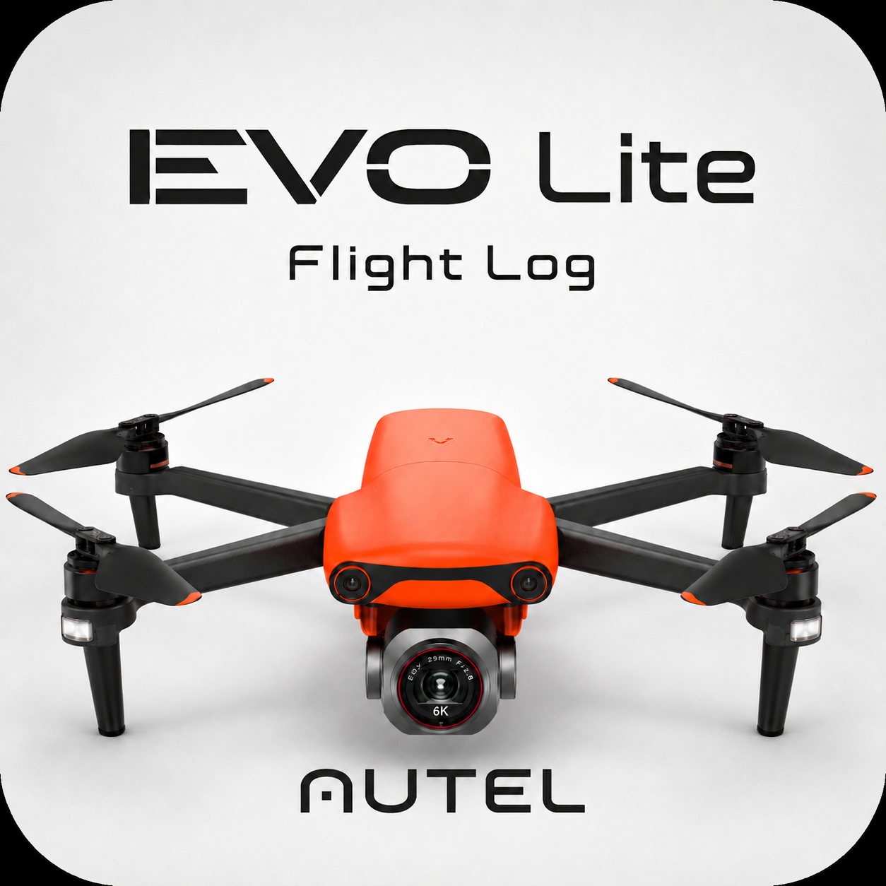

<h1 align="center">Autel EVO Lite / Lite+ ドローン運航記録</h1>

Autel EVO Lite / Lite+ 向けに作成した、スマートフォン操作対応のドローン運航記録Webアプリです。 飛行前点検から着陸・飛行後点検までを入力し、最後にGoogleスプレッドシートへ一括保存します。

## ホーム画面から使う

[ホーム画面追加用のアプリ入口](https://ikifuse.github.io/autel-evo-lite-flight-log/app/)を開いてください。

**iPhone（Safari）**

1. 上の入口をSafariで開きます。「アプリを開く」を押す前に追加してください。
2. 共有ボタン →「ホーム画面に追加」を選びます。
3. 専用アイコンと「ドローン運航記録」を確認して追加します。「Webアプリとして開く」が表示される場合はオンにします。
4. 新しいアイコンから起動すると、従来のGASアプリへ移動します。自動で移動しない場合は「アプリを開く」を押してください。

**Pixel 6a（Chrome）**：同じ入口を開き、メニュー →「ホーム画面に追加」から追加します。起動後、必要なら「アプリを開く」を押してください。

既存アイコンは先に削除せず、新しい入口から正常に使えることを確認してください。ブラウザとホーム画面起動ではログイン・下書きの保存領域が異なる場合があるため、途中の運航は従来の開き方で保存を終えてから切り替えてください。再ログインが求められたら、普段のGoogleアカウントを使います。

入口はアイコン設定とGASへの案内だけを担当し、入力・保存は同じGAS URLで行います。端末側のアイコン採用・遷移は実機での確認が必要です。

## 画面を見ながら操作する

**開始 → 点検 → 離陸 → 着陸 → 継続・交代 → 飛行後点検 → 一括保存**

現行HTML/CSS/JavaScriptをスマートフォン幅で描画した公開用サンプルです。氏名・場所はダミー、登録記号は非表示です。既存の画面画像をそのまま掲載しています。画像を押すと拡大できます。長い画面は一部だけを載せているため、実際の操作では下へスクロールして入力欄やボタンを確認してください。

### 1. 本日の運航を開始

<a href="./docs/images/01-start.png">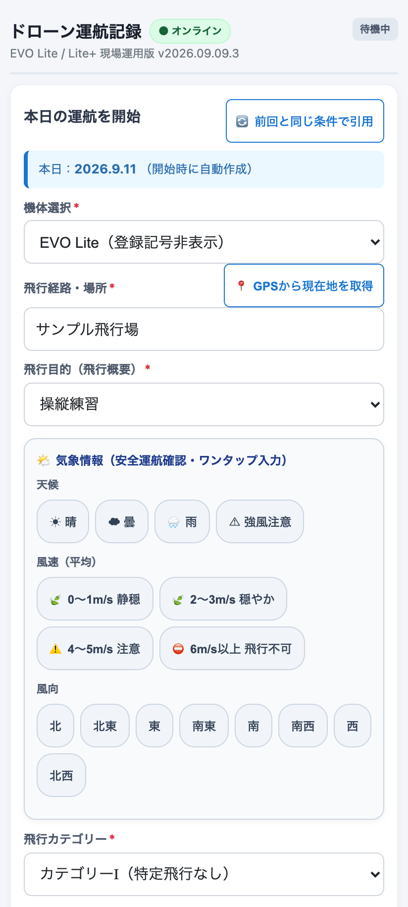</a>

- **操作**：機体、飛行経路・場所、飛行目的、天候・風速・風向、飛行カテゴリー、飛行方法、点検実施場所、操縦者、補助者、技能証明書番号を入力・確認します。表示される場合は許可・承認書番号と有効期限も確認します。「前回と同じ条件で引用」を使った場合も今回の条件へ直してください。
- **押す前に**：選んだ機体と実機が一致し、場所・目的・飛行方法・担当者などに入力漏れがないことを確認します。
- **押すボタン**：画面下部の **「次へ：飛行前点検を開始」**。
- **押した後**：今回の運航を開始し、飛行前点検へ進みます。この時点ではSpreadsheetへの最終保存は行いません。

### 2. 飛行前点検

<a href="./docs/images/02-preflight.png">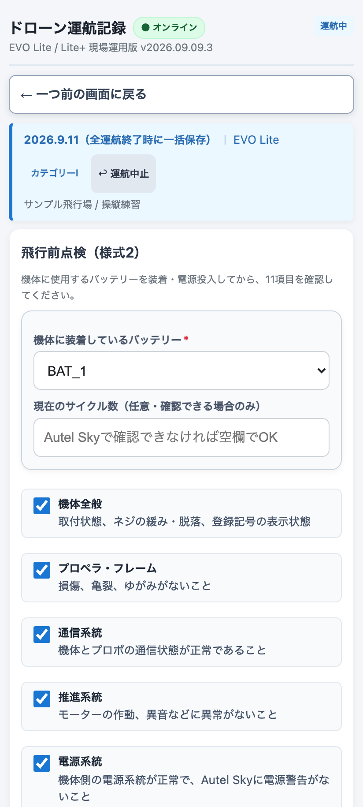</a>

- **操作**：実際に装着しているBAT番号を選び、必要ならサイクル数を入力します。電源を入れた実機で、機体全般、プロペラ・フレーム、通信系統、推進系統、電源系統、自動制御系統、バッテリー、操縦装置（プロポ）、灯火、カメラ、リモートIDの **11項目** を確認します。
- **押す前に**：実機の点検が完了し、BAT番号が一致していることを確認します。「全て正常（実機確認済み）」は、実物を確認してから使います。
- **押すボタン**：画面下部の **「飛行前点検を完了して離陸準備へ」**。
- **押した後**：全項目が正常なら飛行開始待機へ進みます。異常があれば内容を入力してください。異常時は離陸へ進めず、運航終了の案内が表示されます。画面上だけ正常にして進まないでください。

### 3. 飛行開始待機

<a href="./docs/images/03-ready.png">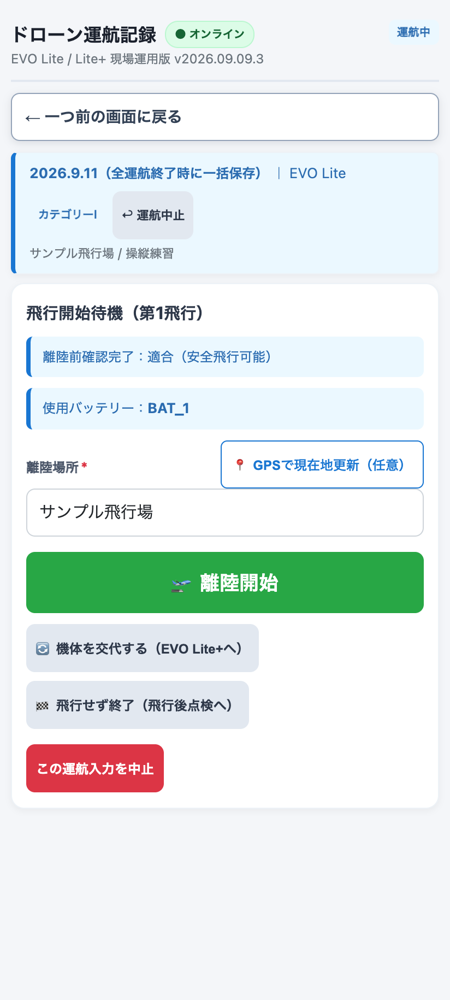</a>

- **操作**：使用機体、BAT番号、サイクル数、離陸場所を確認します。場所は手入力またはGPSで補助入力できます。
- **押す前に**：画面の機体・BAT・場所と実物が一致し、実際に離陸できる状態か確認します。
- **押すボタン**：実際の離陸開始に合わせて **「🛫 離陸開始」**。
- **押した後**：押した時刻を離陸時刻として記録し、飛行中画面でタイマーが動き始めます。

### 4. 飛行中・タイマー

<a href="./docs/images/04-flying.png">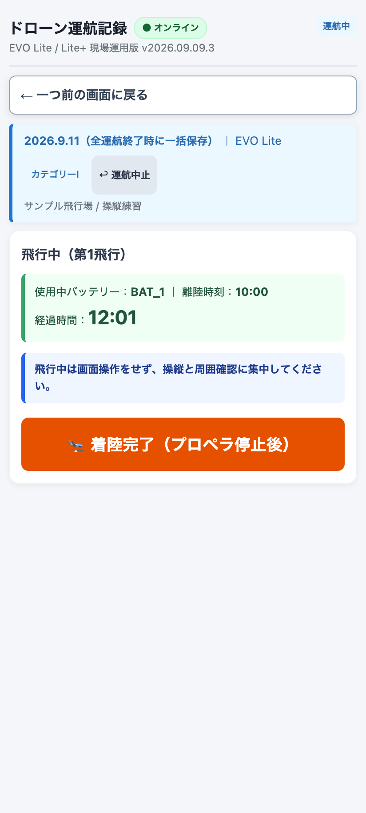</a>

- **操作**：離陸開始からの経過時間が秒単位で表示されます。飛行中は操縦と周囲確認に集中してください。
- **押す前に**：機体が着陸し、プロペラが停止していることを実物で確認します。
- **押すボタン**：着陸・プロペラ停止後に **「🛬 着陸完了（プロペラ停止後）」**。
- **押した後**：着陸時刻を記録してタイマーを止め、着陸後の入力へ進みます。開始・停止を押すタイミングがずれると記録時刻と経過時間もずれます。最終的な飛行分数は、次の画面でAutel Skyの実飛行時間を確認して入力します。

### 5. 着陸後の記録

<a href="./docs/images/05-landing.png">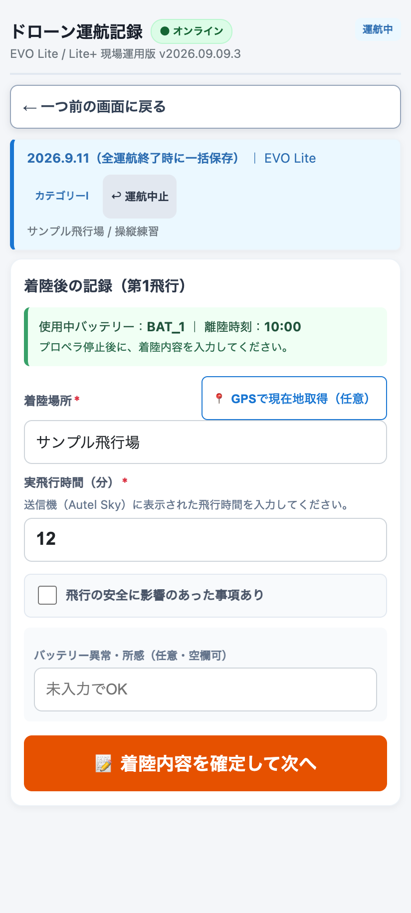</a>

- **操作**：着陸場所、実飛行時間（分）、飛行の安全に影響のあった事項を入力します。安全に影響した事項がある場合は詳細も記入し、必要ならバッテリーの所感を残します。
- **押す前に**：自動表示された目安の分数をそのまま使わず、送信機のAutel Skyで実飛行時間を確認します。場所・異常の記入漏れも確認します。
- **押すボタン**：**「📝 着陸内容を確定して次へ」**。
- **押した後**：この飛行の入力を確定し、着陸記録完了画面へ進みます。ここでの確定は端末内の入力確定です。Spreadsheetへの一括保存は最後に行います。

### 6. 続ける・機体を交代する・終了する

<a href="./docs/images/06-next-action.png">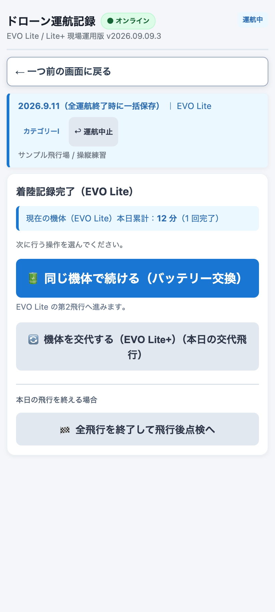</a>

- **操作**：今回の機体の飛行回数・合計時間を確認し、次の行動を選びます。
- **押す前に**：今の飛行が正しく記録されていることと、次に使う機体を確認します。
- **押すボタンと次の画面**：**「🔋 同じ機体で続ける（バッテリー交換）」** → 手順7のBAT確認。 **「🔄 機体を交代する（EVO Lite+）」** など交代先が表示されたボタン → 下記の機体交代。 **「🏁 全飛行を終了して飛行後点検へ」** → 手順8。

#### 機体交代を選んだ場合

着陸記録を確定してから交代先を選び、実際の機体と表示機種を照合します。それまでの飛行記録は保持されます。交代先が今回の運航で飛行前点検をしていなければ手順2へ、点検済みなら手順7のBAT確認へ進みます。どちらの場合も交代先に装着したBAT番号を選び直してください。

### 7. バッテリー交換後の確認

<a href="./docs/images/07-battery-change.png">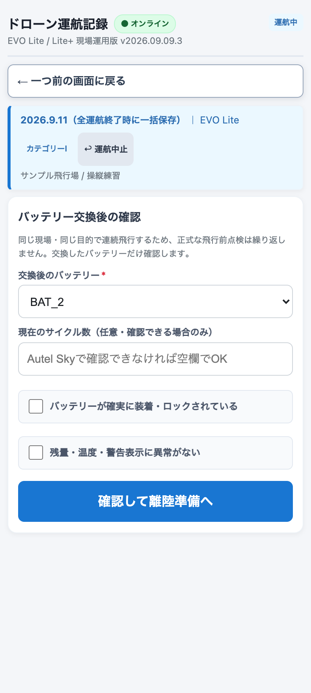</a>

- **操作**：交換して装着したBAT番号を選び直し、必要ならサイクル数を入力します。「確実に装着・ロックされている」「残量・温度・警告表示に異常がない」の2点を実機で確認してチェックします。
- **押す前に**：BAT本体の番号と画面を照合してください。アプリは実物の交換を検出せず、前と同じ番号も選べます。交換したのに前の番号を選んでいないか確認します。
- **押すボタン**：**「確認して離陸準備へ」**。
- **押した後**：飛行開始待機（手順3）へ戻ります。同じ運航内で飛行前点検済みの機体は、BAT確認から次の飛行へ進みます。

### 8. 飛行後点検

<a href="./docs/images/08-postflight.png">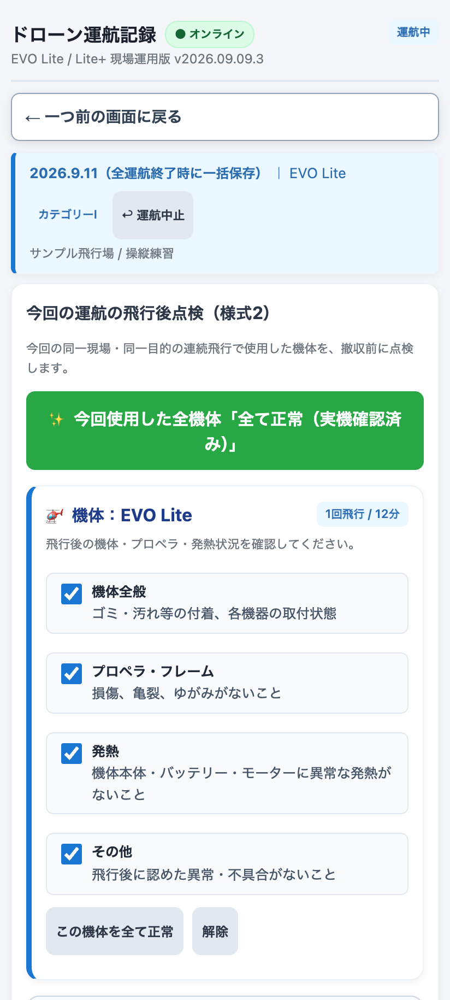</a>

- **操作**：今回使った機体ごとに、機体全般、プロペラ・フレーム、発熱、その他の **4項目** を実機で確認します。2機種を使った場合は両方を点検します。
- **押す前に**：撤収前に実物を確認してください。異常があれば正常扱いにせず、不具合箇所・事象等の内容・処置内容を記入します。
- **押すボタン**：全機体を実際に確認済みの場合だけ **「✨ 今回使用した全機体「全て正常（実機確認済み）」」** を使えます。異常がある場合は各項目を個別に入力してください。
- **押した後**：一括正常ボタンは点検欄へ反映するだけで、保存はしません。同じ画面を下へスクロールして、手順9の最終確認へ進みます。

### 9. 最終保存・確定

<a href="./docs/images/09-save.png">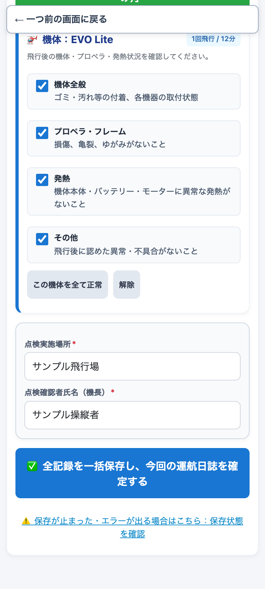</a>

- **操作**：点検実施場所と確認者を入力し、各機体の飛行後点検と異常時の内容を確認します。この画像は手順8と同じ画面の下部です。
- **押す前に**：使った全機体の点検が済み、飛行時間・BAT・場所・確認者が正しく、通信できる状態であることを確認します。
- **押すボタン**：**「✅ 全記録を一括保存し、今回の運航日誌を確定する」**。
- **押した後**：日付シートへ飛行記録と飛行前・飛行後点検を保存し、BAT別履歴と正式な機体累計を反映します。成功すると開始画面へ戻り、 **「運航記録をスプレッドシートへ保存しました。」** と表示されます。この通知まで確認してください。アプリテストでは正式な機体累計は更新しません。

## 保存結果

**実際のSpreadsheet帳票に、2機種・BAT 4個で各10分、合計40分の架空例を記入しました。**

画像で全体を見て、細かな数字は **「PDFを開いて拡大」** から確認できます。iPhoneではPDFを開き、2本指で広げて拡大してください。GitHubのプレビューで拡大しづらい場合は、PDF画面のダウンロードボタンから開いてください。

### 日常点検・飛行記録：記入前 → 記入後

<table>
<tr><th>Before｜記入前</th><th>After｜2機種・4飛行の記入例</th></tr>
<tr>
<td><a href="./docs/pdf/daily-before.pdf">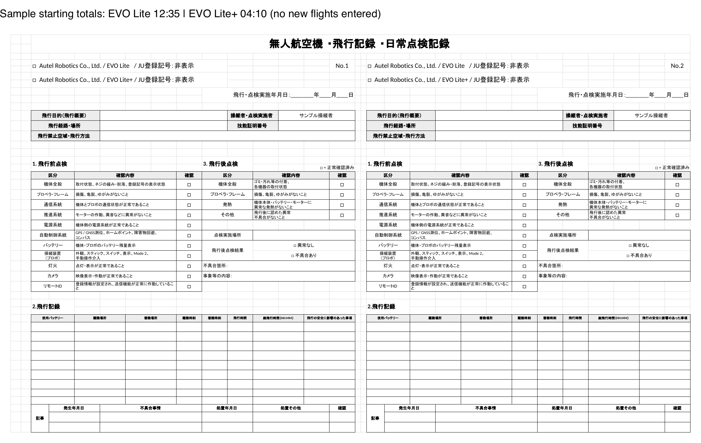</a> <a href="./docs/pdf/daily-before.pdf">PDFを開いて拡大：記入前</a></td>
<td><a href="./docs/pdf/daily-after.pdf">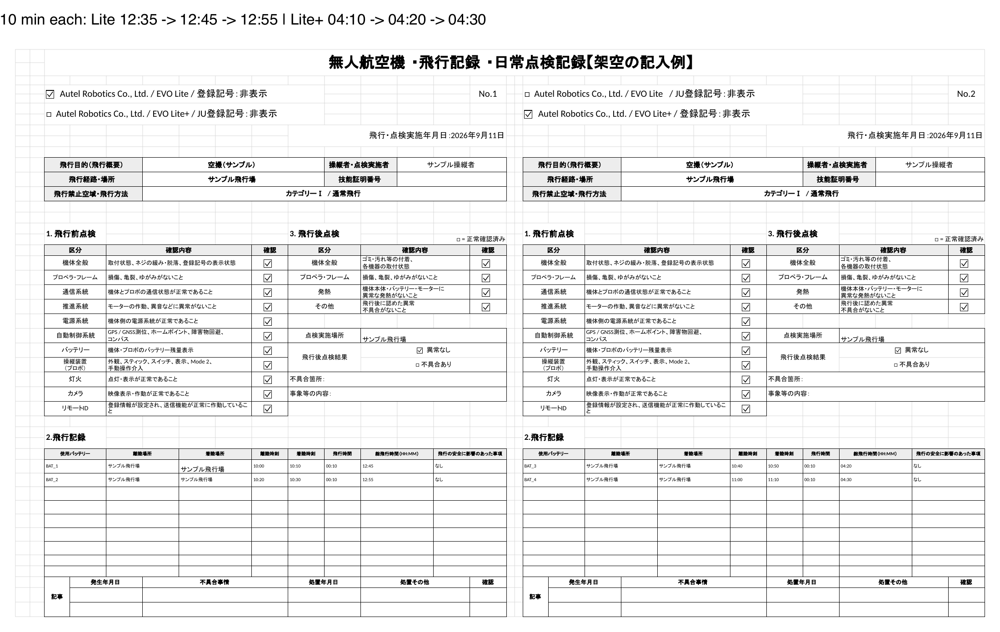</a> <a href="./docs/pdf/daily-after.pdf">PDFを開いて拡大：記入後</a></td>
</tr>
</table>

左のNo.1枠は **EVO Lite：12:35 → 12:45 → 12:55**、右のNo.2枠は **EVO Lite+：04:10 → 04:20 → 04:30**。どちらも今回の飛行は10分を2回、計20分ですが、「総飛行時間（HH:MM）」は過去からの累計です。

| 機体 | 開始累計（原本） | 1飛行目・10分後 | 2飛行目・10分後 | 保存後の原本 |
|---|---|---|---|---|
| EVO Lite | 12:35 | 12:45 | 12:55 | 12:55 |
| EVO Lite+ | 04:10 | 04:20 | 04:30 | 04:30 |

点検整備記録の現在累計を引き継ぎ、各飛行の実飛行時間を順次加算して日付シートへ記録し、最終保存で原本の累計も更新します。正式な開始値は、新しい保存計画を作る時点で原本から読み取ります。再試行では既存の保存計画を使います。

**00:00は管理開始時の初期値であり、毎回00:00へ戻す意味ではありません。** 原則は製造後の積算時間です。従来記録がない場合、国交省ガイドラインには新制度運用開始以降から起算し、その旨を日誌冒頭等へ明記する扱いがあります。任意のアプリ導入日で過去累計をリセットする意味ではありません。原本の開始値・起算の根拠は利用者が確認してください。上のWebアプリ画面紹介とは別のサンプル運航です。

### 機種別の点検整備記録

<table>
<tr><th>EVO Lite</th><th>EVO Lite+</th></tr>
<tr>
<td><a href="./docs/pdf/inspection-lite.pdf">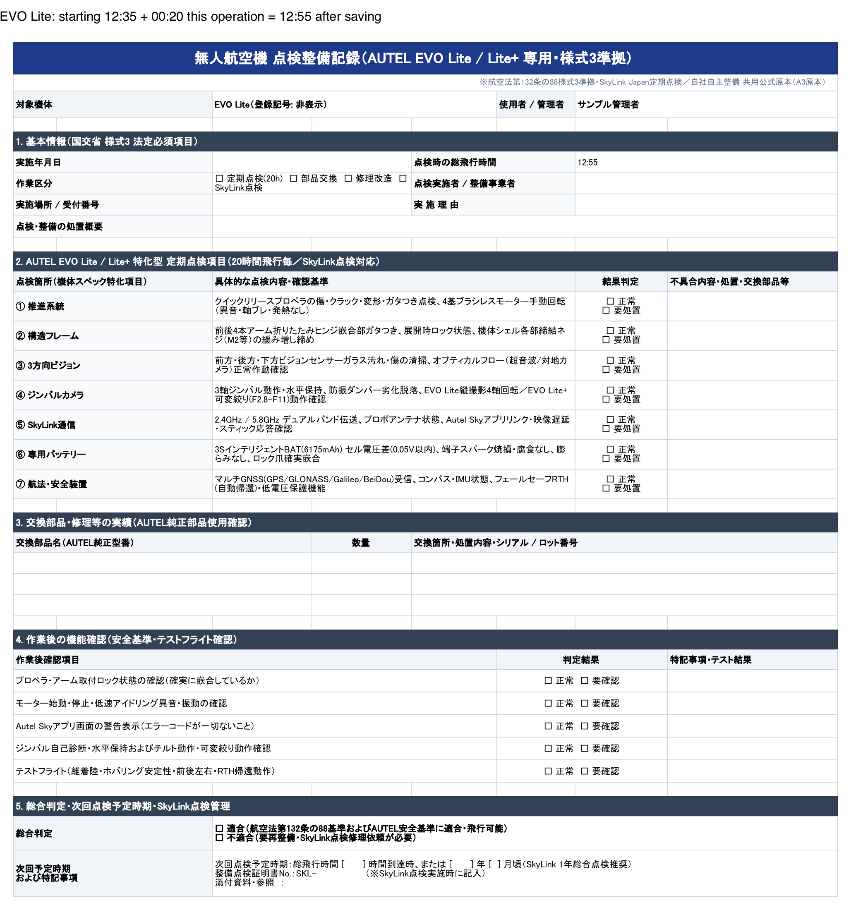</a> <a href="./docs/pdf/inspection-lite.pdf">PDFを開いて拡大：EVO Lite</a></td>
<td><a href="./docs/pdf/inspection-lite-plus.pdf">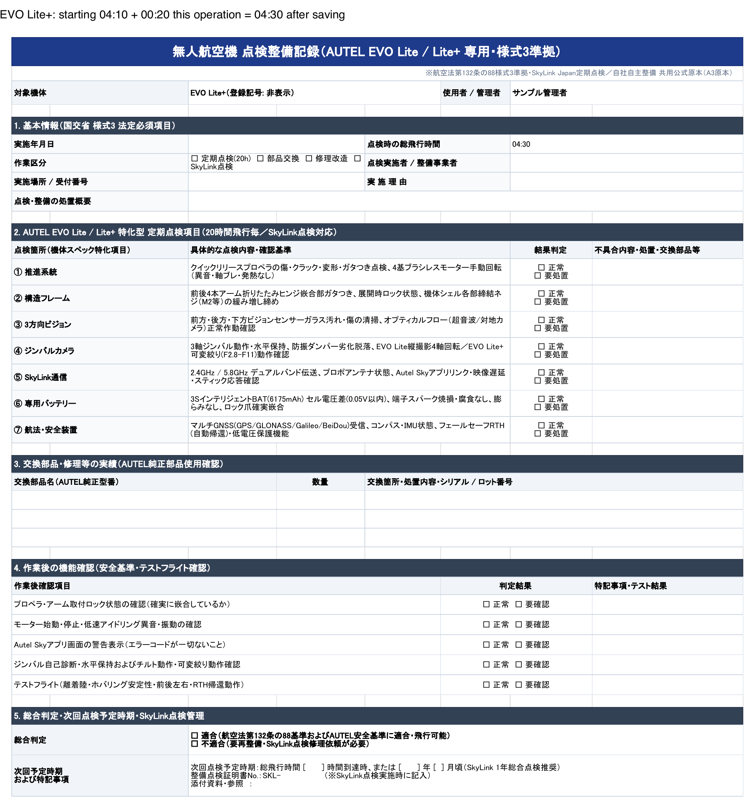</a> <a href="./docs/pdf/inspection-lite-plus.pdf">PDFを開いて拡大：EVO Lite+</a></td>
</tr>
</table>

機種ごとの「点検時の総飛行時間」は **EVO Liteが12:55、EVO Lite+が04:30**。上の日付シートの各機体の最終行と一致します。この点検整備記録は日常点検とは別の帳票です。定期点検・整備の結果欄は運航保存で自動的に埋まるものではないため、未記入のまま掲載しています。

### バッテリー台帳

<a href="./docs/pdf/battery-ledger.pdf">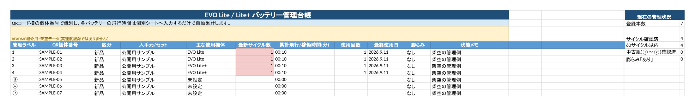</a>

[PDFを開いて拡大：バッテリー台帳](./docs/pdf/battery-ledger.pdf)

7個の管理状況を一覧表示。今回の例ではBAT_1～4が各10分、残り3個は未使用です。

### バッテリー個別管理：BAT_1

<a href="./docs/pdf/battery-1.pdf">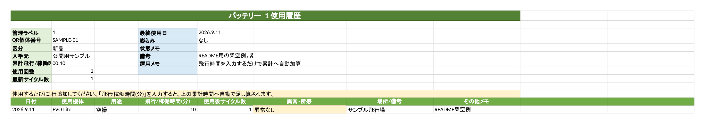</a>

[PDFを開いて拡大：BAT_1の使用履歴](./docs/pdf/battery-1.pdf)

個別シートは代表としてBAT_1だけを掲載。使用機体、10分の飛行、場所、異常の有無を1行で確認できます。

掲載データとPDFについて

実帳票のコピーから氏名・登録記号・個体番号・実運航情報を除き、紹介用の架空データを記入してGoogle SheetsからPDFを書き出しました。本番Spreadsheetや保存処理は変更していません。これは帳票の記入例であり、アプリで実際に保存した証明ではありません。BATの累計・サイクル・最終使用日はコピー内で例示値を設定しています。

記入前画像も生成済み日付シートの空欄例として「総飛行時間（HH:MM）」を表示しています。本番の「日常点検」原本は変更していません。

PDF上端の補足は開始累計と今回加算の説明です。

PDFは帳票の文字・罫線を保持し、周囲の余白だけを詰めています。書き出し時に非表示になったチェック記号は、PDF内に残る文字と位置に基づいて描画を補正しています。元帳票のセル幅による一部の見出し・備考の省略表示は残ります。

## 主な特徴

- 飛行前点検から飛行後点検まで、現場の順番に沿って入力。
- 複数飛行、バッテリー交換、EVO Lite / Lite+の機体交代をひと続きで記録。
- 日付シート・BAT別履歴・機体別累計へ最後に一括保存。
- 戻る操作、端末への下書き保持、保存失敗時の再試行に対応。
- GPS・手入力・前回条件の引用・補助者の端末内履歴で入力を補助。
- アプリテストはTEST用日付シートへ記録し、正式な機体累計から除外。
- Pixel 6aの縦画面を基準にした表示と、入力検証・数式実行防止。

## 操作に困ったとき・保存される記録

### 戻る・保存の再試行・下書き復元

- 入力途中は「一つ前の画面に戻る」で前工程を修正できます。
- 保存に失敗したら入力を破棄せず、通信を確認して同じ運航の保存を再試行します。新しい運航を作り直す必要はありません。
- 状況が分からない場合は、飛行後点検画面下部の「保存状態を確認」から診断します。
- 開始済みの運航下書きは、同じブラウザで再読込すると復元されます。開始前の未確定入力や、ブラウザのデータ消去後まで保持を保証するものではありません。
- 「端末への下書き保存に失敗しました」と表示されたら、画面を閉じたり再読み込みしたりせず、入力を控えてください。圏外ではSpreadsheetへ送信できません。

### 作成される記録

- 通常運航：`2026.9.11`、`2026.9.11_2`などの日付シート。
- アプリテスト：`TEST_2026.9.11`など。BAT履歴も記録しますが、正式な機体累計は更新しません。
- BAT別履歴：`BAT_1`～`BAT_7`。
- 正式な機体累計：`点検整備記録_EVO Lite_原本` / `点検整備記録_EVO Lite+_原本`。
- 点検整備記録：原本を必要時に複製し、利用者が記入・管理します。

1飛行を1行に記録します。1つのNo.ブロックは最大7飛行で、8飛行目以降や機体交代時は次の空きブロックへ進みます。No.1 / No.2が埋まると同日の連番シートを作成します。日付シートの飛行時点の累計と、機体別原本の正式累計は別に管理します。

## 利用上の注意

**法定記録のすべてをアプリだけで自動作成するものではありません。** 製造番号等の機体概要、日跨ぎの明示、不具合の実際の発生日・処置日、飛行前異常で中止した際の記録、整備作業の履歴には未対応または手動補完が必要な部分があります。[記載事項の確認結果](./docs/flight-log-review-2026-09-11.md)を確認してください。

本アプリは、法令上必要な記録を残しながら、ワンオペの現場で迷わず短時間に入力することを目指した記録支援ツールです。飛行可否の判断、許可・承認の要否確認、機体整備、安全確保そのものを代替するものではありません。

公開版は **v1.0.0 — Initial stable release**、現行アプリ内部版は **2026.09.09.3** です。前者は公開リポジトリの安定版、後者はアプリ内の実装バージョンを示します。Webアプリの掲載画像はローカル描画であり、実機・本番GASでの表示確認を示すものではありません。

## 実際の記録を見る

このリポジトリでは、運用状況と改善過程を監査証跡として確認できるよう、実際のスプレッドシートを閲覧・コメント可能な状態で共有しています。編集権限は所有者だけとする運用です。

- [運航記録スプレッドシート全体](https://docs.google.com/spreadsheets/d/10PMEteELQRRWnqc5mVmF6tQCfxFEJEGe2LitpDhYqk8/edit?usp=sharing)
- [EVO Lite 機体別点検整備原本](https://docs.google.com/spreadsheets/d/10PMEteELQRRWnqc5mVmF6tQCfxFEJEGe2LitpDhYqk8/edit?gid=905861131#gid=905861131)
- [EVO Lite+ 機体別点検整備原本](https://docs.google.com/spreadsheets/d/10PMEteELQRRWnqc5mVmF6tQCfxFEJEGe2LitpDhYqk8/edit?gid=1025530824#gid=1025530824)
- [コメント・改善提案用シート](https://docs.google.com/spreadsheets/d/10PMEteELQRRWnqc5mVmF6tQCfxFEJEGe2LitpDhYqk8/edit?gid=1729383143#gid=1729383143)
- [GitHub Issues](https://github.com/ikifuse/autel-evo-lite-flight-log/issues)

実データには操縦者名、登録記号、飛行場所などが含まれます。公開範囲と個人情報の扱いは、利用者自身の運用方針に合わせて設定してください。非表示シートや保護範囲は秘密保持の手段にはなりません。

## 公式情報

- [国土交通省：無人航空機の飛行日誌の取扱要領・様式1～3](https://www.mlit.go.jp/koku/content/001574394.pdf)
- [国土交通省：無人航空機の飛行日誌の取扱いに関するガイドライン](https://www.mlit.go.jp/common/001599241.pdf)
- [国土交通省：飛行計画の通報・飛行日誌の作成](https://www.mlit.go.jp/koku/operation.html)
- [国土交通省：ドローン情報基盤システム2.0](https://www.mlit.go.jp/koku/koku_ua_dips.html)
- [DIPS 2.0 ポータル](https://www.ossportal.dips.mlit.go.jp/portal/top/?lang=ja)
- [国土交通省：飛行許可・承認申請](https://www.mlit.go.jp/koku/permitapproval/)

法令・行政手続・公式システムは変更されることがあります。実際の飛行前には、必ず最新の公式情報を確認してください。

## 開発者向け文書

内部構成、責務分割、ビルド方法、コードマップは[ドキュメント案内](./docs/index.md)、[アーキテクチャ](./docs/architecture.md)、[コードマップ](./docs/code-map.md)を参照してください。ソースの正本は`src/`、GASへ反映するファイルは自動生成された`dist/Code.gs`です。

## GASへの反映手順

通常、利用者が確認するのは次の2点だけです。

1. GitHub Actionsが成功していること
2. 最新の `dist/Code.gs`

反映手順は次のとおりです。

1. `dist/Code.gs` の全文をコピーします。
2. GASプロジェクトの `Code.gs` を全文貼り替えします。
3. GASで保存します。
4. 既存Webアプリのデプロイを更新します。
5. Pixel側でWebアプリを再読み込みします。

`src/` の各 `.gs` ファイルをGASへ個別に貼る必要はありません。`dist/Code.gs` は自動生成物なので、直接編集しないでください。

開発者向けのビルド、分割構成、保存の冪等性、テスト、障害復旧などの詳細や各文書の役割は、[ドキュメント案内](./docs/index.md)、[設計書](./01_ドローン運航記録_設計書.md)、[コードマップ](./docs/code-map.md)を参照してください。

## 公開範囲とライセンス

このリポジトリは、実装と改善履歴を確認できるよう公開されています。

現時点では、リポジトリ内に `LICENSE` ファイルはありません。ソースコードが閲覧可能であることと、第三者へ利用・改変・再配布の許諾が与えられていることは同じではありません。利用条件を明示する場合は、別途ライセンスを追加してください。

---

<!-- Autelロゴ出典: https://manuals.autelrobotics.com/logo.png （公式ドキュメントサイト）。既存ロゴを白背景で表示。 -->
<table>
<tr>
<td></td>
<td>本プロジェクトは非公式であり、Autel Roboticsとは関係ありません。 This is an unofficial project and is not affiliated with Autel Robotics.</td>
</tr>
</table>
