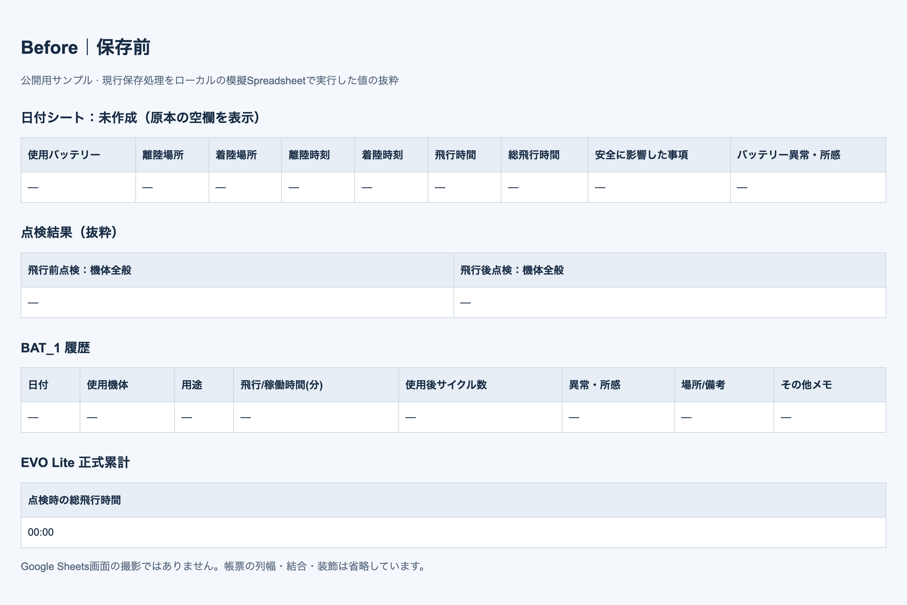
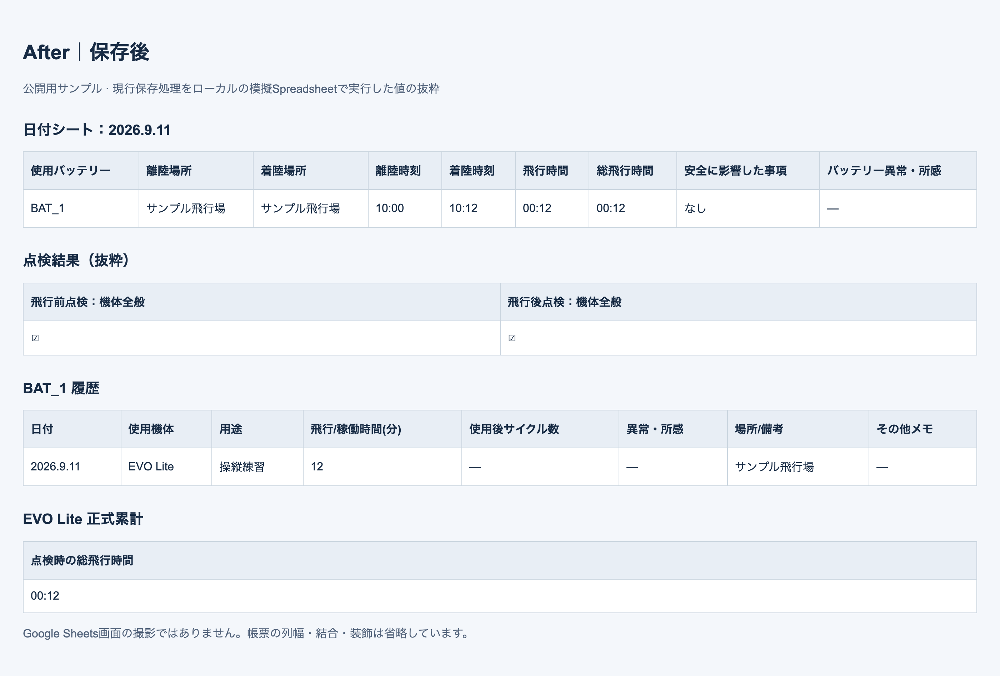

  

<h1 align="center">Autel EVO Lite / Lite+ ドローン運航記録</h1>

Autel EVO Lite / Lite+ 向けに作成した、スマートフォン操作対応のドローン運航記録Webアプリです。 飛行前点検から着陸・飛行後点検までを入力し、最後にGoogleスプレッドシートへ一括保存します。

## 画面の流れ

**開始 → 点検 → 離陸 → 着陸 → 継続・交代 → 飛行後点検 → 一括保存**

現行HTML/CSS/JavaScriptをスマートフォン幅で描画した公開用サンプルです。氏名・場所はダミー、登録記号は非表示です。長い画面は一部を掲載しています。画像を押すと拡大できます。

<table>
<tr>
<th>1. 本日の運航を開始</th>
<th>2. 飛行前点検</th>
<th>3. 飛行開始待機</th>
</tr>
<tr>
<td valign="top"> 機体・場所・目的などを入力します。</td>
<td valign="top"> 装着したBATと11項目を確認します。</td>
<td valign="top"> 離陸場所を確認して「離陸開始」。</td>
</tr>
</table>

<table>
<tr>
<th>4. 飛行中</th>
<th>5. 着陸後の記録</th>
<th>6. 着陸記録完了</th>
</tr>
<tr>
<td valign="top"> 経過時間を表示。操縦と周囲確認に集中します。</td>
<td valign="top"> タイマー停止後、実飛行時間などを入力します。</td>
<td valign="top"> 同じ機体で継続・機体交代・終了を選びます。</td>
</tr>
</table>

<table>
<tr>
<th>7. バッテリー交換後確認</th>
<th>8. 飛行後点検</th>
<th>9. 保存・確定</th>
</tr>
<tr>
<td valign="top"> 継続する場合は交換したBATを確認します。</td>
<td valign="top"> 今回使用した機体を撤収前に点検します。</td>
<td valign="top"> 飛行後点検画面の下部から一括保存します。</td>
</tr>
</table>

バッテリー交換は継続時の分岐です。飛行を終える場合は「着陸記録完了」から飛行後点検へ進みます。

保存専用の独立画面はありません。飛行後点検画面の「全記録を一括保存し、今回の運航日誌を確定する」で保存し、成功すると開始画面へ戻り、保存成功の通知が表示されます。

## 保存結果

**Before：記録なし → After：12分の飛行・点検結果・BAT履歴・正式累計を記録**

<table>
<tr><th>Before｜保存前</th><th>After｜保存後</th></tr>
<tr>
<td></td>
<td></td>
</tr>
</table>

現行の保存処理を、既存テストの**模擬Spreadsheet**と安全なサンプルで実行した結果です。画像は保存値を表にした抜粋で、Google Sheetsの実画面ではありません。原本の結合セルや装飾は省略しています。本番データは使用・変更していません。

## 主な特徴

- 飛行前点検から飛行後点検まで、現場の順番に沿って入力。
- 複数飛行、バッテリー交換、EVO Lite / Lite+の機体交代をひと続きで記録。
- 日付シート・BAT別履歴・機体別累計へ最後に一括保存。
- 戻る操作、端末への下書き保持、保存失敗時の再試行に対応。
- GPS・手入力・前回条件の引用・補助者の端末内履歴で入力を補助。
- アプリテストはTEST用日付シートへ記録し、正式な機体累計から除外。
- Pixel 6aの縦画面を基準にした表示と、入力検証・数式実行防止。

## 詳しい使い方

1. **開始**：機体、飛行経路・場所、目的、飛行方法、操縦者・補助者などを入力します。必要に応じてGPSや「前回と同じ条件で引用」を利用します。
2. **飛行前点検**：使用するBATを装着して電源を入れ、11項目を実機で確認します。異常がある場合は離陸へ進まず、飛行を中止して対応します。
3. **離陸**：待機画面でBATと離陸場所を確認し、「離陸開始」を押します。離陸時刻と経過時間の計測が始まります。
4. **飛行中**：画面操作をせず、操縦と周囲確認に集中します。
5. **着陸**：プロペラ停止後に「着陸完了」を押します。着陸場所、送信機（Autel Sky）で確認した実飛行時間、安全に影響した事項、必要ならBATの所感を入力し、着陸内容を確定します。
6. **バッテリー交換**：続ける場合は「同じ機体で続ける」を選び、交換したBATを確認して次の離陸へ進みます。
7. **機体交代**：「機体を交代する」を選びます。交代先の飛行前点検が未完了なら点検画面へ、完了済みならBAT確認へ進みます。
8. **飛行後点検**：「全飛行を終了して飛行後点検へ」を選び、今回使った機体の状態と点検場所・確認者を入力します。
9. **保存**：「全記録を一括保存し、今回の運航日誌を確定する」を押し、保存成功の通知を確認します。飛行ごとの着陸確定は端末内の入力確定であり、Spreadsheetへの保存はこの最後の操作で行います。

### 戻る・保存の再試行・下書き復元

- 入力途中は「一つ前の画面に戻る」で前工程を修正できます。
- 保存に失敗したら入力を破棄せず、通信を確認して同じ運航の保存を再試行します。保存先が確定済みの場合は、その計画に沿って再開します。
- 状況が分からない場合は、飛行後点検画面下部の「保存状態を確認」から診断します。
- 開始済みの運航下書きは、同じブラウザで再読込すると復元されます。開始前の未確定入力や、ブラウザのデータ消去後まで保持を保証するものではありません。
- 「端末への下書き保存に失敗しました」と表示されたら、画面を閉じたり再読み込みしたりせず、入力を控えてください。圏外ではSpreadsheetへ送信できません。

### 作成される記録

- 通常運航：`2026.9.11`、`2026.9.11_2`などの日付シート。
- アプリテスト：`TEST_2026.9.11`など。BAT履歴も記録しますが、正式な機体累計は更新しません。
- BAT別履歴：`BAT_1`～`BAT_7`。
- 正式な機体累計：`点検整備記録_EVO Lite_原本` / `点検整備記録_EVO Lite+_原本`。
- 点検整備記録：原本を必要時に複製し、利用者が記入・管理します。

1飛行を1行に記録します。1つのNo.ブロックは最大7飛行で、8飛行目以降や機体交代時は次の空きブロックへ進みます。No.1 / No.2が埋まると同日の連番シートを作成します。日付シートの飛行時点の累計と、機体別原本の正式累計は別に管理します。

## 利用上の注意

本アプリは、法令上必要な記録を残しながら、ワンオペの現場で迷わず短時間に入力することを目指した記録支援ツールです。飛行可否の判断、許可・承認の要否確認、機体整備、安全確保そのものを代替するものではありません。

公開版は **v1.0.0 — Initial stable release**、現行アプリ内部版は **2026.09.09.3** です。前者は公開リポジトリの安定版、後者はアプリ内の実装バージョンを示します。掲載画像はローカル描画であり、実機・本番GASでの表示確認を示すものではありません。

## 実際の記録を見る

このリポジトリでは、運用状況と改善過程を監査証跡として確認できるよう、実際のスプレッドシートを閲覧・コメント可能な状態で共有しています。編集権限は所有者だけとする運用です。

- [運航記録スプレッドシート全体](https://docs.google.com/spreadsheets/d/10PMEteELQRRWnqc5mVmF6tQCfxFEJEGe2LitpDhYqk8/edit?usp=sharing)
- [EVO Lite 機体別点検整備原本](https://docs.google.com/spreadsheets/d/10PMEteELQRRWnqc5mVmF6tQCfxFEJEGe2LitpDhYqk8/edit?gid=905861131#gid=905861131)
- [EVO Lite+ 機体別点検整備原本](https://docs.google.com/spreadsheets/d/10PMEteELQRRWnqc5mVmF6tQCfxFEJEGe2LitpDhYqk8/edit?gid=1025530824#gid=1025530824)
- [コメント・改善提案用シート](https://docs.google.com/spreadsheets/d/10PMEteELQRRWnqc5mVmF6tQCfxFEJEGe2LitpDhYqk8/edit?gid=1729383143#gid=1729383143)
- [GitHub Issues](https://github.com/ikifuse/autel-evo-lite-flight-log/issues)

実データには操縦者名、登録記号、飛行場所などが含まれます。公開範囲と個人情報の扱いは、利用者自身の運用方針に合わせて設定してください。非表示シートや保護範囲は秘密保持の手段にはなりません。

## 公式情報

- [国土交通省：無人航空機の飛行日誌の取扱要領](https://www.mlit.go.jp/common/001599241.pdf)
- [国土交通省：飛行計画の通報・飛行日誌の作成](https://www.mlit.go.jp/koku/operation.html)
- [国土交通省：ドローン情報基盤システム2.0](https://www.mlit.go.jp/koku/koku_ua_dips.html)
- [DIPS 2.0 ポータル](https://www.ossportal.dips.mlit.go.jp/portal/top/?lang=ja)
- [国土交通省：飛行許可・承認申請](https://www.mlit.go.jp/koku/permitapproval/)

法令・行政手続・公式システムは変更されることがあります。実際の飛行前には、必ず最新の公式情報を確認してください。

## 開発者向け文書

内部構成、責務分割、ビルド方法、コードマップは[ドキュメント案内](./docs/index.md)、[アーキテクチャ](./docs/architecture.md)、[コードマップ](./docs/code-map.md)を参照してください。ソースの正本は`src/`、GASへ反映するファイルは自動生成された`dist/Code.gs`です。

## GASへの反映手順

通常、利用者が確認するのは次の2点だけです。

1. GitHub Actionsが成功していること
2. 最新の `dist/Code.gs`

反映手順は次のとおりです。

1. `dist/Code.gs` の全文をコピーします。
2. GASプロジェクトの `Code.gs` を全文貼り替えします。
3. GASで保存します。
4. 既存Webアプリのデプロイを更新します。
5. Pixel側でWebアプリを再読み込みします。

`src/` の各 `.gs` ファイルをGASへ個別に貼る必要はありません。`dist/Code.gs` は自動生成物なので、直接編集しないでください。

開発者向けのビルド、分割構成、保存の冪等性、テスト、障害復旧などの詳細や各文書の役割は、[ドキュメント案内](./docs/index.md)、[設計書](./01_ドローン運航記録_設計書.md)、[コードマップ](./docs/code-map.md)を参照してください。

## 公開範囲とライセンス

このリポジトリは、実装と改善履歴を確認できるよう公開されています。

現時点では、リポジトリ内に `LICENSE` ファイルはありません。ソースコードが閲覧可能であることと、第三者へ利用・改変・再配布の許諾が与えられていることは同じではありません。利用条件を明示する場合は、別途ライセンスを追加してください。

---

<!-- Autelロゴ出典: https://manuals.autelrobotics.com/logo.png （公式ドキュメントサイト）。既存ロゴを白背景で表示。 -->
<table>
<tr>
<td></td>
<td>本プロジェクトは非公式であり、Autel Roboticsとは関係ありません。 This is an unofficial project and is not affiliated with Autel Robotics.</td>
</tr>
</table>
